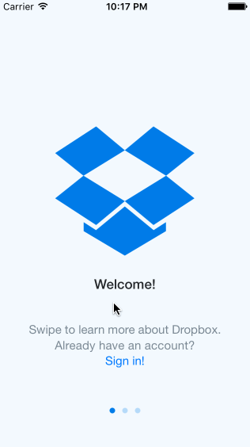

# Week-1-Dropbox-app

Created a dummy Dropbox app using storyboards and static images. 

Total time spent: 8 hours

Completed user stories:

- User can tap through the 3 welcome screens.
- User can follow the create user flow.
- User can follow the sign in flow.
- User can logout
- User can interact with logged in content and tab bar

Notes:

Got sick this weekend and didn't get time to add in optional user flows :*(

